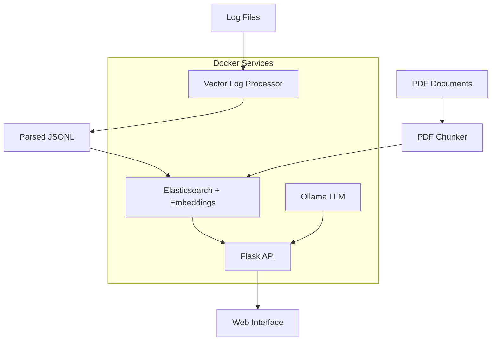

# AM Elastic Logs - AI-Powered Log Analysis System


An intelligent log analysis system that combines **Elasticsearch**, **Vector**, and **Ollama** to provide AI-powered anomaly detection and analysis of application logs. The system processes log files, performs semantic search, and uses local LLM models to identify anomalies and provide actionable insights.

## 🚀 Features

- **🔍 Semantic Log Search**: Vector embeddings with Elasticsearch for intelligent log querying
- **🤖 AI-Powered Anomaly Detection**: Local LLM analysis using Ollama with Phi3 model  
- **📊 Real-time Processing**: Vector log processing with throttling and parsing
- **📄 Document Analysis**: PDF processing and indexing capabilities
- **🌐 Web Interface**: Clean, intuitive web UI for log analysis
- **🐳 Containerized**: Full Docker Compose deployment
- **⚡ Health Monitoring**: Built-in health checks for all services

## 🏗️ Architecture



### Components

- **Vector**: Log parsing and processing pipeline
- **Elasticsearch**: Vector search engine with embedding storage
- **Ollama**: Local LLM service (Phi3 model)
- **Flask API**: RESTful backend with semantic search and AI analysis
- **Web UI**: Interactive frontend for log exploration

## 📋 Prerequisites

- Docker Engine 20.10+
- Docker Compose 2.0+
- At least 8GB RAM (recommended 16GB)
- 10GB+ free disk space

## 🚀 Quick Start

### 1. Clone the Repository
```bash
git clone https://github.com/yourusername/am-elastic-logs.git
cd am-elastic-logs
```

### 2. Prepare Your Log Data
Place your log files in the `logs/` directory:
```bash
mkdir -p logs
# Copy your .log files to logs/
cp /path/to/your/*.log logs/
```

### 3. Add Documentation (Optional)
Place PDF documents in the `docs/` directory:
```bash
mkdir -p docs
# Copy your PDF files to docs/
cp /path/to/your/*.pdf docs/
```

### 4. Start the System
```bash
docker-compose up -d
```

### 5. Wait for Services to Initialize
Monitor the startup process:
```bash
docker-compose logs -f
```

The system is ready when you see:
- ✅ Elasticsearch cluster health: green
- ✅ Ollama model downloaded: phi3
- ✅ Vector processing completed
- ✅ Flask API health check passing

### 6. Access the Web Interface
Open your browser to: http://localhost:8000

## 📖 Usage Guide

### Web Interface

1. **Navigate to http://localhost:8000**
2. **Enter your query** in natural language:
   - "What errors occurred in the last hour?"
   - "Show me payment failures"
   - "Find authentication issues"
3. **Adjust the result count** (1-100 logs)
4. **Click "Analyze"** to get:
   - AI-generated summary
   - Detected anomalies with severity levels
   - Recommended next actions

### API Endpoints

#### Search Logs
```bash
curl -X POST http://localhost:8000/query \
  -H "Content-Type: application/json" \
  -d '{"query": "authentication failed", "k": 10}'
```

#### Anomaly Detection
```bash
curl -X POST http://localhost:8000/anomalies \
  -H "Content-Type: application/json" \
  -d '{"query": "recent errors", "k": 20}'
```

#### Health Check
```bash
curl http://localhost:8000/health
```

## ⚙️ Configuration

### Environment Variables

Configure services by editing `docker-compose.yml`:

| Variable | Default | Description |
|----------|---------|-------------|
| `MODEL` | `phi3` | Ollama model name |
| `OLLAMA_URL` | `http://ollama:11434` | Ollama service URL |
| `ES_HOST` | `http://elasticsearch:9200` | Elasticsearch URL |
| `EMBED_MODEL` | `sentence-transformers/all-MiniLM-L6-v2` | Embedding model |
| `TOP_K` | `8` | Default search results |
| `CHUNK_SIZE` | `8` | LLM processing chunk size |

### Log Format Support

The system supports various log formats:

#### AM-style Logs
```
2024-01-15 10:30:45.123 [thread-1] ERROR - (ClassName:123) Error message here
```

#### GC Logs
```
[2.456s][info][gc] GC(1) Concurrent Mark Cycle 25.123ms
```

#### Generic Logs
Any unrecognized format is preserved as raw text.

## 🗂️ Project Structure

```
am-elastic-logs/
├── api/                    # Flask API service
│   ├── app.py             # Main Flask application
│   ├── build_index.py     # Elasticsearch indexing
│   ├── pdf_chunker.py     # PDF processing utilities
│   ├── templates/         # HTML templates
│   ├── static/           # CSS/JS assets
│   ├── Dockerfile        # API container definition
│   └── requirements.txt  # Python dependencies
├── vector/               # Log processing service
│   ├── vector.toml      # Vector configuration
│   └── Dockerfile       # Vector container definition
├── logs/                # Log files input directory
├── docs/                # PDF documents directory  
├── clean/               # Processed logs output
├── index/               # Search indices
├── docker-compose.yml   # Service orchestration
└── README.md           # This file
```

## 🔧 Development

### Running in Development Mode

1. **Start infrastructure services**:
```bash
docker-compose up elasticsearch ollama vector -d
```

2. **Install Python dependencies**:
```bash
cd api
pip install -r requirements.txt
```

3. **Run Flask in development mode**:
```bash
export FLASK_ENV=development
python app.py
```

### Adding New Log Formats

Edit `vector/vector.toml` to add new parsing rules:

```toml
[transforms.parse_custom]
type = "remap"
inputs = ["logs_throttled"]
source = '''
  # Add your custom parsing logic here
  custom, err = parse_regex(.raw, r'your-regex-pattern')
  if err == null {
    .timestamp = custom.ts
    .level = custom.level
    .message = custom.msg
  }
'''
```

### Extending the API

Add new endpoints in `api/app.py`:

```python
@app.route("/custom", methods=["POST"])
def custom_analysis():
    # Your custom analysis logic
    return jsonify({"result": "data"})
```

## 🐛 Troubleshooting

### Common Issues

#### Services Not Starting
```bash
# Check service logs
docker-compose logs elasticsearch
docker-compose logs ollama
docker-compose logs vector

# Restart services
docker-compose restart
```

#### Out of Memory Errors
- Increase Docker memory allocation (8GB+ recommended)
- Reduce `ES_JAVA_OPTS` in docker-compose.yml
- Lower the `k` parameter in queries

#### No Logs Being Processed
- Check log file format compatibility
- Verify logs are in the `logs/` directory
- Monitor Vector processing: `docker-compose logs vector`

#### Elasticsearch Connection Issues
- Verify Elasticsearch health: `curl http://localhost:9200/_cluster/health`
- Check network connectivity between containers
- Increase startup timeout in health checks

### Performance Tuning

#### For Large Log Volumes
```yaml
# In docker-compose.yml
environment:
  - ES_JAVA_OPTS=-Xms4g -Xmx4g  # Increase ES memory
  - CHUNK_SIZE=16               # Larger LLM chunks
```

#### For Better Accuracy
```yaml
environment:
  - TOP_K=50                    # More context for AI
  - EMBED_MODEL=sentence-transformers/all-mpnet-base-v2  # Better embeddings
```

## 📊 Monitoring

### Health Checks
All services include health checks:
- **Elasticsearch**: Cluster health API
- **Ollama**: Model availability check
- **Vector**: Output file verification
- **Flask API**: Combined service status

### Metrics
Monitor with:
```bash
# Service status
docker-compose ps

# Resource usage
docker stats

# Log volume
docker-compose exec vector ls -la /data/clean/
```

## 🤝 Contributing

1. Fork the repository
2. Create a feature branch: `git checkout -b feature-name`
3. Make your changes
4. Add tests if applicable
5. Commit changes: `git commit -am 'Add feature'`
6. Push to branch: `git push origin feature-name`
7. Submit a Pull Request

### Code Style
- Follow PEP 8 for Python code
- Use meaningful variable names
- Add docstrings to functions
- Include error handling

### Testing
```bash
# Run tests (when implemented)
cd api
python -m pytest tests/
```

## 📄 License

This project is licensed under the MIT License - see the [LICENSE](LICENSE) file for details.

## 🙏 Acknowledgments

- **[Elasticsearch](https://www.elastic.co/)** - Search and analytics engine
- **[Vector](https://vector.dev/)** - High-performance log processing
- **[Ollama](https://ollama.ai/)** - Local LLM inference
- **[Sentence Transformers](https://www.sbert.net/)** - Text embeddings
- **[Flask](https://flask.palletsprojects.com/)** - Web framework

## 📞 Support

- Create an issue for bug reports
- Check existing issues for solutions
- Contribute improvements via Pull Requests

---

**Made with ❤️ for intelligent log analysis**